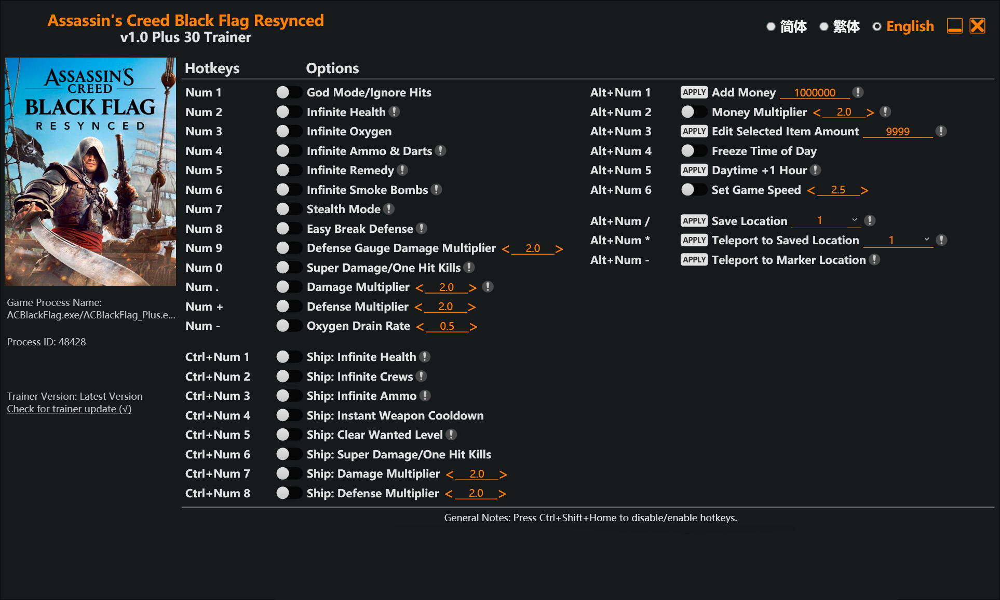

# 🏴‍☠️ Assassin's Creed Black Flag Resynced Trainer 

A powerful, high-performance memory modifier utility designed for **Assassin's Creed IV: Black Flag (Resynced Edition)**. This lightweight trainer hooks directly into the game engine process to grant real-time modifications, custom multipliers, item injections, and coordinate-based teleportation utilities.

Optimized for minimal resource usage, and zero performance degradation.

---

## 🚀 Key Features

* **Complete Player Control:** Toggle God Mode, infinite stamina/oxygen, stealth modes, and customize damage or defense multipliers on the fly.
* **Jackdaw Ship Customization:** Take absolute control of the seas with infinite hull health, crew management, ammunition bypass, and instant mortar/cannon weapon cooldowns.
* **Economic Injections:** Dynamically add currency (Reals), lock time-of-day progression, or modify inventory quantities of selected items instantly.
* **Vector Teleportation System:** Save specific coordinates and teleport instantly across the map or snap directly to user-defined map markers.

---

## ⌨️ Hotkeys & Options Reference

### 👤 Player Hacks
| Hotkey | Cheat Option | Description / Modifiers |
| :--- | :--- | :--- |
| **Num 1** | 🛡️ God Mode / Ignore Hits | Absolute damage immunity from all standard sources. |
| **Num 2** | ❤️ Infinite Health | Keeps health pool filled continuously. |
| **Num 3** | 🤿 Infinite Oxygen | Disables drowning mechanics during underwater segments. |
| **Num 4** | 🔫 Infinite Ammo & Darts | Ammunition and sleep/berserk darts never deplete. |
| **Num 5** | 🧪 Infinite Remedy | Unlimited use of healing medicine packs. |
| **Num 6** | 💨 Infinite Smoke Bombs | Infinite tactical crowd-control smoke bombs. |
| **Num 7** | 🥷 Stealth Mode | Ghost mode—enemies completely ignore your presence. |
| **Num 8** | ⚔️ Easy Break Defense | Instantly break any enemy guard archetype. |
| **Num 9** | 📉 Defense Gauge Multiplier | Adjust enemy defense degradation rate `< Default: 2.0 >` |
| **Num 0** | 💥 Super Damage / One-Hit Kills | Eliminates any hostile target with a single strike. |
| **Num .** | 🔺 Damage Multiplier | Scale output damage dynamically `< Default: 2.0 >` |
| **Num +** | 🛡️ Defense Multiplier | Scale incoming damage protection `< Default: 2.0 >` |
| **Num -** | ⏳ Oxygen Drain Rate | Tweak how fast lungs deplete safely underwater `< Default: 0.5 >` |

### ⛵ Naval & Ship Hacks (The Jackdaw)
| Hotkey | Cheat Option | Description / Modifiers |
| :--- | :--- | :--- |
| **Ctrl + Num 1** | ⚓ Ship: Infinite Health | The Jackdaw takes zero structural or hull damage. |
| **Ctrl + Num 2** | 👥 Ship: Infinite Crew | Crew count remains locked at max; never lose sailors. |
| **Ctrl + Num 3** | 💣 Ship: Infinite Ammo | Unlimited heavy shot, fire barrels, mortars, and round shot. |
| **Ctrl + Num 4** | ⚡ Ship: Instant Weapon Cooldown | Zero delay between broadside or mortar firing loops. |
| **Ctrl + Num 5** | ❌ Ship: Clear Wanted Level | Instantly clears Hunter tracking status on the open sea. |
| **Ctrl + Num 6** | 🔥 Ship: Super Damage / One-Hit Kills| Instantly sink or disable any legendary or rogue ship. |
| **Ctrl + Num 7** | 📈 Ship: Damage Multiplier | Scale up ship cannon damage factors `< Default: 2.0 >` |
| **Ctrl + Num 8** | 📉 Ship: Defense Multiplier | Scale up ship armor resilience factors `< Default: 2.0 >` |

### 💰 Economy, Time & Teleportation
| Hotkey | Cheat Option | Description / Modifiers |
| :--- | :--- | :--- |
| **Alt + Num 1** | 🪙 Add Money | Directly injects **+1,000,000 Reals** into currency pool. |
| **Alt + Num 2** | 📈 Money Multiplier | Multiplies all picked up or rewarded currency `< Default: 2.0 >` |
| **Alt + Num 3** | 🎒 Edit Selected Item Amount | Changes current item selection count directly to **9999**. |
| **Alt + Num 4** | 🧊 Freeze Time of Day | Halts the game engine day/night lighting cycle. |
| **Alt + Num 5** | ☀️ Daytime +1 Hour | Advances current environmental time forward by 60 mins. |
| **Alt + Num 6** | 🏃 Set Game Speed | Speeds up or slows down internal game clock `< Default: 2.5 >` |
| **Alt + Num /** | 💾 Save Location | Commits current XYZ coordinates to memory slot 1. |
| **Alt + Num \*** | 🌀 Teleport to Saved Location | Snaps actor coordinates instantly back to the saved slot. |
| **Alt + Num -** | 📍 Teleport to Marker Location | Rewrites position bytes to custom map waypoint vector. |

---

## 🛠️ Installation & Usage

1. **Extract Assets:** Download and unpack the trainer executable into any directory (or drop it directly into the game root installation path).
2. **Launch Sequence:** * Run the game client first.
   * Alt-Tab out and launch the trainer executable with administrator privileges.
3. **Execution:** Return to the game instance. Listen for an audio confirmation cue or check the built-in UI indicators to verify memory attachment success. Use designated Numpad hotkeys to manipulate runtime vectors.

> ⚠️ **IMPORTANT SAFETY NOTICES & HOTKEY TOGGLES**
> * **Global Killswitch:** Pressing `Ctrl + Shift + Home` globally freezes or unfreezes all hotkey scanner tasks. Use this if your keybindings clash with in-game quick-time events (QTEs).
> * **Teleport Warning:** When leveraging the **Teleport to Marker Location** option, ensure the map asset has fully loaded into active RAM buffers before triggering the jump to prevent world falling glitches.

---

## 🔍 Search Optimization & Technical Specifications

* **Target Process Names:** `ACBlackFlag.exe`, `ACBlackFlag_Plus.exe`
* **SEO Meta Keywords:** Assassin's Creed Black Flag Resynced Trainer, AC4 Black Flag PC Trainer, Infinite Money Glitch AC4, Jackdaw Hull, One Hit Kills Mod Black Flag, Teleporte Edward Kenway God Mode.
